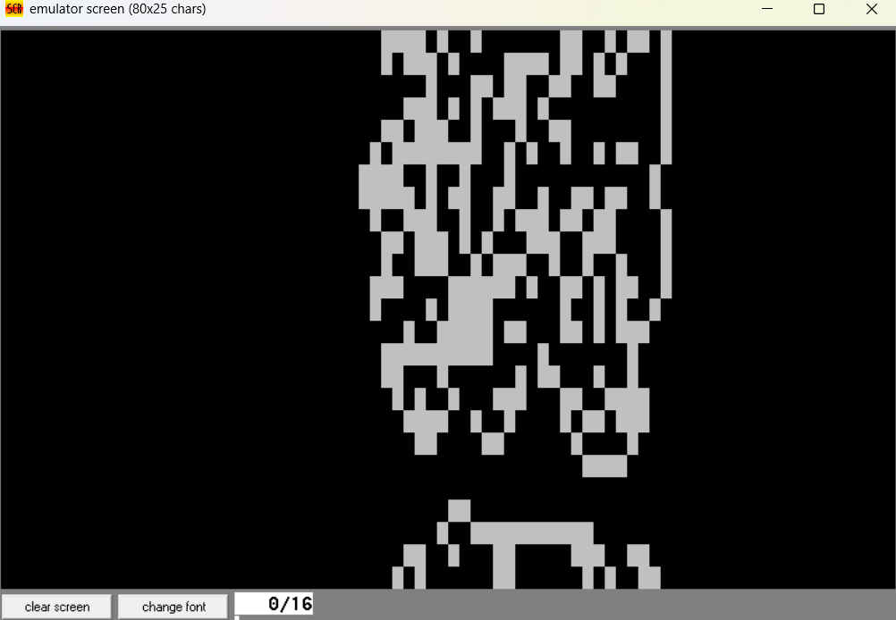

# Langton's Ant: x86 Assembly Implementation

A low-level implementation of the **Langton's Ant** cellular automaton, written in 16-bit x86 Assembly. This project demonstrates emergent, pseudo-random complexity arising from a deterministic rule set, leveraging BIOS interrupts for memory state management and video rendering.

## Overview

Langton's Ant is a two-dimensional universal Turing machine. An autonomous agent (the "ant") traverses a grid of binary-state cells (black and white) governed by two strict rules based on the current cell's state:

1. **At a White square:** Turn 90° right, invert the cell to Black, and advance one unit.
2. **At a Black square:** Turn 90° left, invert the cell to White, and advance one unit.

This simulation visualizes the transition from initial symmetry through a chaotic, pseudo-random growth phase, ultimately leading to stable emergent structures or grid saturation, depending on the boundary logic.

## Technical Features

* **Direct Video Memory State Management:** Instead of allocating a 2D array in RAM, the grid utilizes the Text Mode (03h) video memory buffer directly. State evaluations are performed via `INT 10h / AH=08h` (Read Character at Cursor).
* **Toroidal Boundary Wrapping:** Implements unbounded grid simulation on a strictly bounded $80 \times 25$ display using coordinate underflow/overflow checks.
* **Asynchronous Input Polling:** Utilizes `INT 16h` for non-blocking keyboard buffer polling, allowing real-time speed adjustments without interrupting the CPU cycle loop.
* **Visual Agent Rendering:** Features a two-step rendering pipeline that buffers the cell state, draws the visual agent (red cursor), and applies the logic trail sequentially.

## Requirements & Execution

This program was developed for standard DOS environments and 16-bit emulators.

* **Compiler/Emulator:** EMU8086 or compiled via MASM/TASM for DOSBox.
* **Execution:** Load `main.asm` and compile/emulate as a `.COM` executable.

## Controls

The simulation runs autonomously, but execution speed can be managed dynamically:

* `f` - Increase simulation speed (Decreases internal CPU delay cycles)
* `s` - Decrease simulation speed (Increases internal CPU delay cycles)
* `q` - Terminate execution

## Simulation Output

  
*Grid saturation and chaotic clustering occurring after extended computational cycles.*

## Architecture & Logic Flow

1. **Coordinate Translation:** Computes agent position matrix.
2. **State Buffer:** Reads current character ASCII at the cursor location.
3. **Agent Render:** Paints the active agent sprite for visual telemetry.
4. **Delay & Interrupt Poll:** Wastes CPU cycles for visual pacing while polling for hotkeys.
5. **Logic Resolution:** Evaluates the buffered state and executes appropriate orientation changes.
6. **Trail Render:** Overwrites the agent sprite with the post-logic cell state.
7. **Boundary Verification:** Processes screen edge collisions via wrap-around logic.
